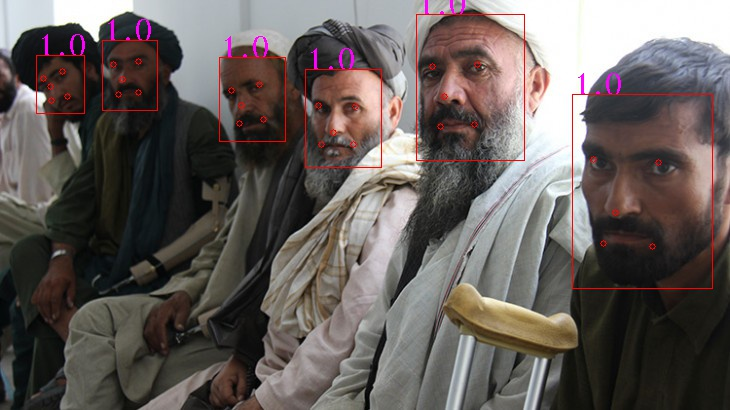

# Experiment to Train Multi-Task CNN to detect faces. GPU is required.



## Setup

1. Git clone repository

2. Download and unzip WIDER Face training data (http://mmlab.ie.cuhk.edu.hk/projects/WIDERFace/) to a folder on your computer 

3. Download and unzip Facial Point Detection training data (http://mmlab.ie.cuhk.edu.hk/archive/CNN/data/train.zip) or Celeba training data (http://mmlab.ie.cuhk.edu.hk/projects/CelebA.html) to same folder on your computer as used in step #2 above.

Your unzipped training data folder should look like:
```
/path/to/your/unzipped_training_data/
   + lfw_5590
   + net_7876
   - testImageList.txt
   - trainImageList.txt
   + WIDER_train
```

4. Build container
```
docker build -f Dockerfile.mtcnn_train -t vfs.mtcnn_train .
```
5. Run container
```
nvidia-docker run -v /path/to/your/unzipped_training_data:/mtcnn_training_data vfs.mtcnn_train
```

## Inside Docker Container

1. Change the slashes in trainImageList for Linux
```
sed -i 's.\\./.g' /mtcnn_training_data/trainImageList.txt
```

2. Run gen_12net_data.py in the prepare_data folder to generate training data (Face Detection) for PNet.
```
cd /prog
python gen_12net_data.py
```

3. Run gen_landmark_aug_12.py in the prepare_data folder to generate training data (Face Landmark Detection) for PNet.
``` 
python gen_landmark_aug_12.py 
```

4. Run gen_imglist_pnet.py in the prepare_data folder to merge two parts of training data.
Run gen_imglist_pnet.py to merge two parts of training data.
```
python gen_PNet_tfrecords.py 
```

5. Run train_PNet.py in the train_models folder to train PNet.
```
cd /prog/train_models
python train_PNet.py 
```

6. Run gen_hard_example in the prepare_data folder with the PNet test_type to generate training data (Face Detection) for RNet. 
```
cd /prog/prepare_data
python gen_hard_example --test_type PNet
```

7. Run gen_landmark_aug_24.py in the prepare_data folder to generate training data (Face Landmark Detection) for RNet. 
```
python gen_landmark_aug_24.py
```

8. Run gen_imglist_rnet.py in the prepare_data folder to merge two parts of training data.
```
python gen_imglist_rnet.py
```

9. Run gen_RNet_tfrecords.py in the prepare_data folder to generate tfrecords for RNet.
(Note: Script automatically iterates four times to generate tfrecords of neg,pos,part and landmark)
```
python gen_RNet_tfrecords.py
```

10. Run train_RNet.py in the train_models folder to train RNet.
```
cd /prog/train_models
python train_RNet.py
```

11. Run gen_hard_example in the prepare_data folder with the RNet test_type to generate training data (Face Detection) for ONet.
```
cd /prog/prepare_data
python gen_hard_example.py --test_type RNet
```

12. Run gen_landmark_aug_48.py to generate training data (Face Landmark Detection) for ONet.
```
python gen_landmark_aug_48.py 
```

13. Run gen_imglist_onet.py to merge two parts of training data.
```
python gen_imglist_onet.py
```

14. Run gen_ONet_tfrecords.py to generate tfrecords for ONet.
(Note: Script automatically iterates four times to generate tfrecords of neg,pos,part and landmark)
```
python gen_ONet_tfrecords.py
```

15. Run train_ONet.py in the train_models folder to train ONet.
```
cd /prog/train_models
python train_ONet.py
```

16. Test trained model on test images located in /prog/test/test_images/
```
cd /prog/test
python one_image_test.py
```
